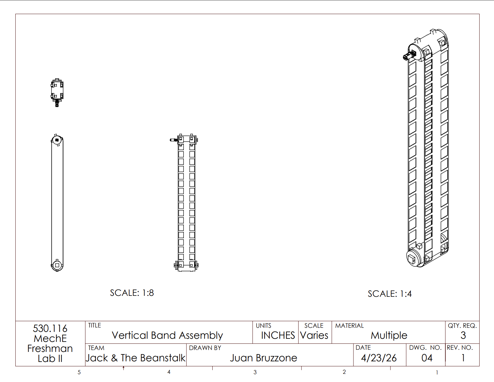
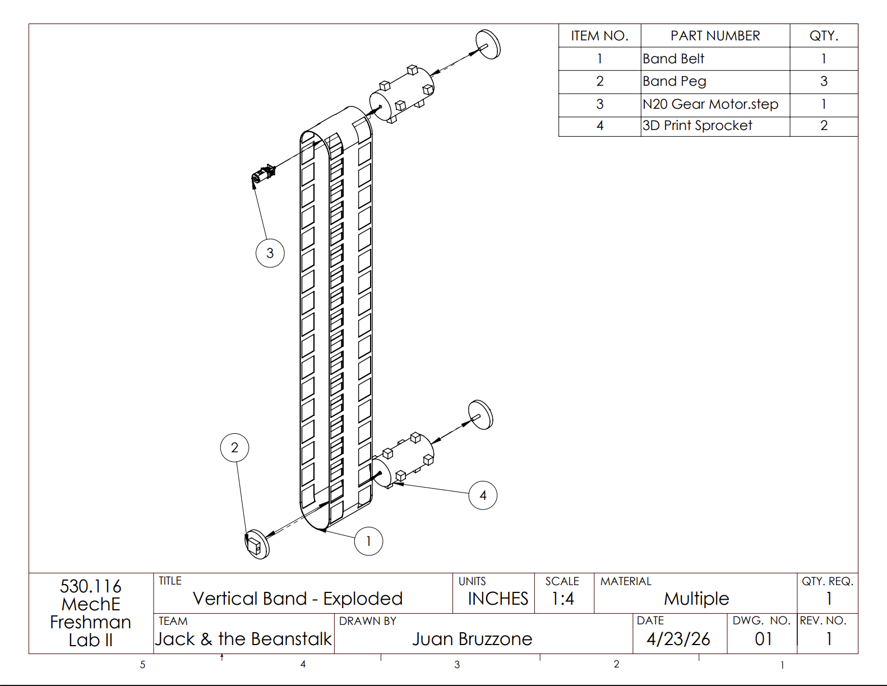
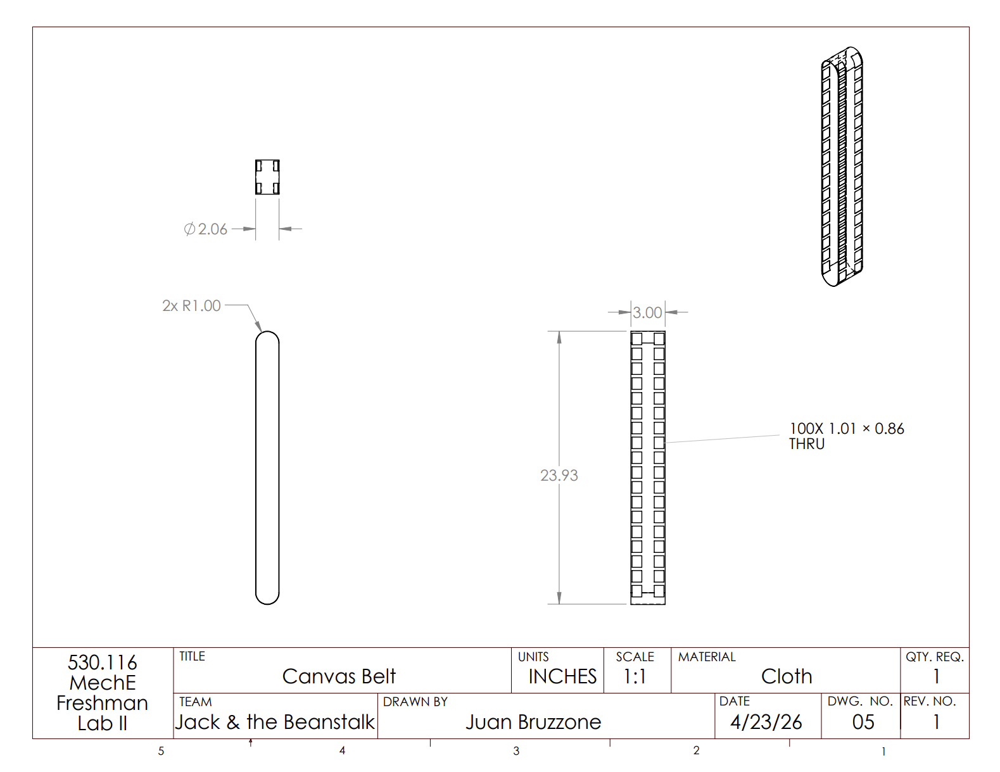
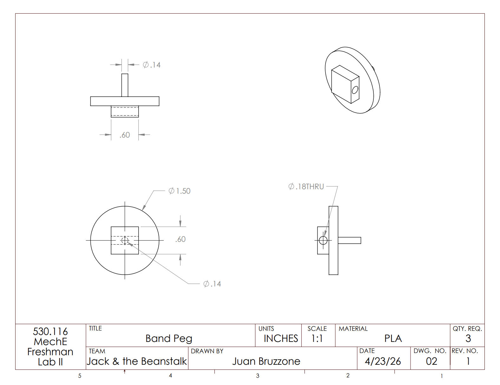
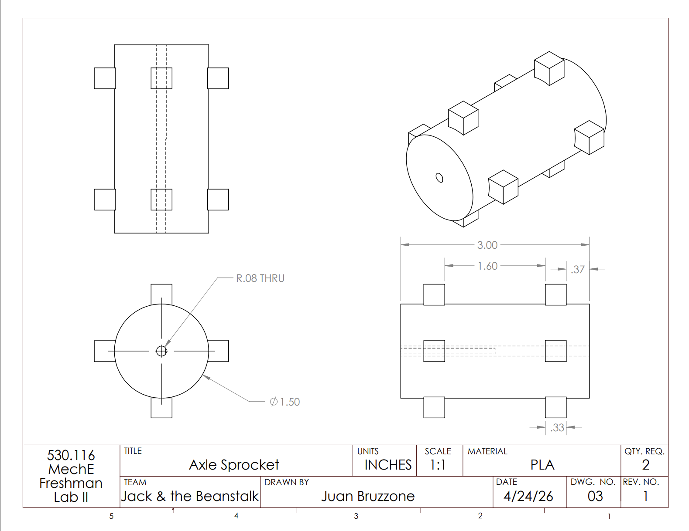
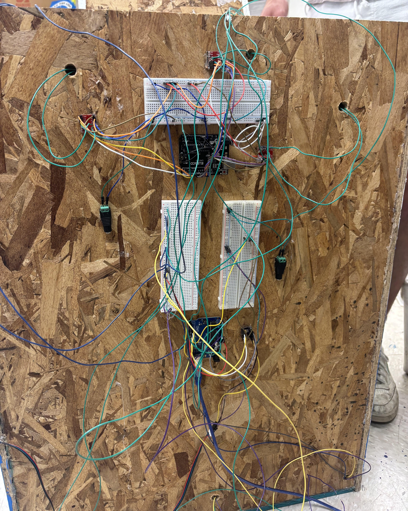
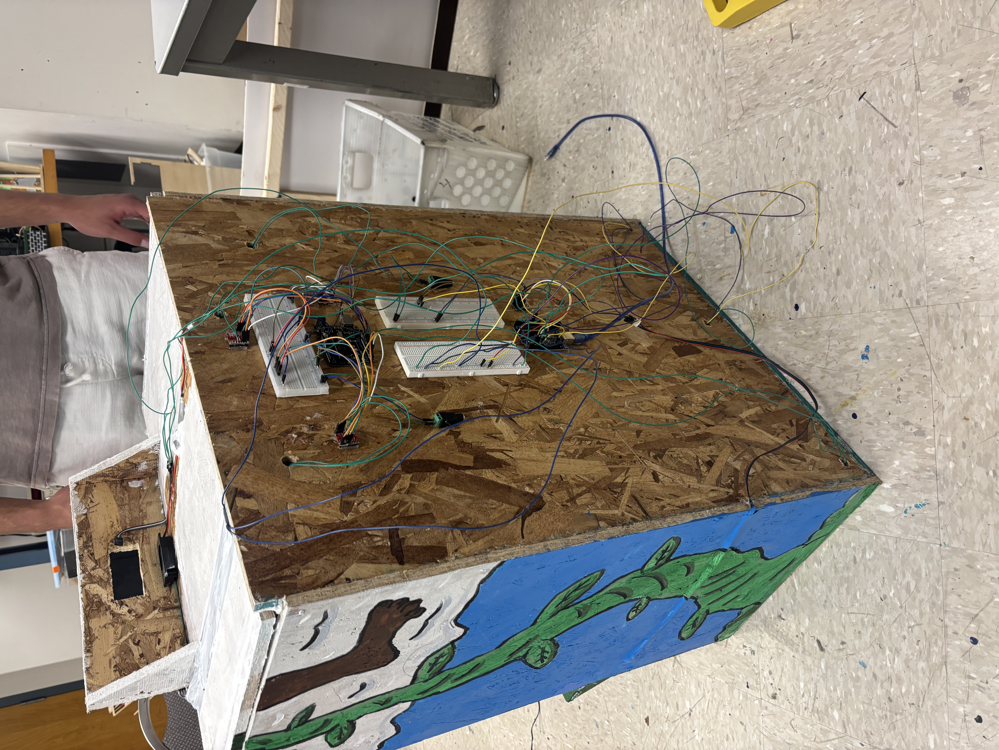
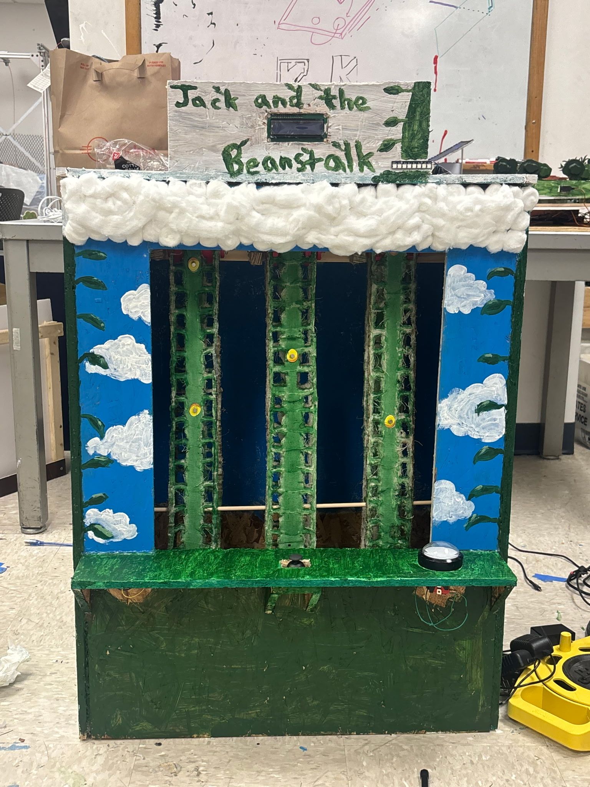

# "Catch the Falling Objects" - Arcade Game Build

## Game Concept

The arcade game, based on Jack and the Beanstalk, was designed to be a classic “catch the falling objects” concept. Golden eggs fall from the clouds down the beanstalks and the user has to control a basket to catch the eggs as they fall. Every egg that passes through the basket adds a point to the player’s tally, and the goal is to catch as many eggs as possible within the 30 second time constraint. We have three manufactured vertical timing belts that rotate throughout the 30 seconds; they have eggs attached to them with magnets on the front. The basket is on a horizontal belt at the bottom of the game, with a hall effect sensor on the side that faces the vertical belts. The basket can move to three set positions in front of each of the bands, sensing the magnet when an egg passes by. At the end of the 30 seconds the basket returns to the middle position and everything stops spinning until the start button is pressed again.

---

## Demo Video
https://github.com/user-attachments/assets/57ea5e9a-5529-44c0-9c8f-fc6eea5776d1

## CAD Drawings - Vertical Band

The CAD drawings below show the mechanical design and custom manufactured components used in the arcade game build.

  
   
  <a href="cad/Game_Belt_Orthographic.pdf">PDF Link</a>

  
  
   
  <a href="cad/Game_Belt_Exploded.pdf">PDF Link</a>
  &nbsp;&nbsp;&nbsp;&nbsp;&nbsp;&nbsp;&nbsp;&nbsp;&nbsp;&nbsp;&nbsp;&nbsp;&nbsp;&nbsp;&nbsp;&nbsp;
  <a href="cad/Slotted_Drive_Belt_Orthographic.pdf">PDF Link</a>

  
  
   
  <a href="cad/Idler_Roller_Orthographic.pdf">PDF Link</a>
  &nbsp;&nbsp;&nbsp;&nbsp;&nbsp;&nbsp;&nbsp;&nbsp;&nbsp;&nbsp;&nbsp;&nbsp;&nbsp;&nbsp;&nbsp;&nbsp;
  <a href="cad/Drive_Sprocket_Orthographic%20(1).pdf">PDF Link</a>

## Programming/Electronics

The game was programmed in C++.

The code controls the logic of the arcade game, including player input, movement timing, system response, and reset behavior. It is split into two different circuits to deal with varying voltage levels and interference from the motors onto the sensor.

  
  

### Arduino Code Files

- [Main Game Code](code/HorizontalBandCode.ino)
- [Sensor/Motor Circuit Code](code/VerticalBandCode.ino)

## Design Process

### Initial Concept

The original goal of the project was to create a classic “catch the falling objects” arcade game inspired by *Jack and the Beanstalk*. Golden eggs would travel down moving vertical bands while the player controlled a basket that moved horizontally across the bottom of the game. The basket had to align with the falling eggs and detect them using a hall effect sensor and magnets attached to the eggs.

From the beginning, the project required the integration of multiple subsystems: moving mechanical components, sensors, motors, timing systems, and game logic written in C++. The player experience was intended to feel fast-paced and interactive while still being mechanically reliable.

---

### Mechanical Design

The mechanical design centered around four belt-driven systems working together simultaneously. Three vertical timing belts rotated continuously to simulate falling eggs, while a horizontal belt moved the basket between three fixed positions. Precision and alignment were critical because the hall effect sensor needed to line up exactly with the magnets attached to the eggs.

The team designed and manufactured many of the physical components from scratch, including the vertical bands, sprockets, and support systems. CAD modeling was used extensively to design the assemblies, spacing, and alignment of the moving systems. One important design decision was leaving the top of the game unattached so the internal systems could be accessed easily for troubleshooting and repairs without disassembling the entire structure.

Another important mechanical challenge involved wire routing and interference. The hall effect sensor wiring originally interfered with the movement of the basket system, so additional slack was added and dowels were used to redirect the wires underneath the bands and away from moving components.

---

### Prototyping and Testing

The project required significant iteration and troubleshooting throughout the build process. Many ideas that worked conceptually on paper revealed practical problems once the systems were physically assembled.

One recurring issue involved the custom-manufactured vertical bands. Because they were built from scratch, they occasionally wobbled during rotation, which sometimes caused the sensor to miss the magnets. The team repeatedly adjusted alignment, spacing, and support structures to improve reliability.

Electrical interference was another major challenge. The motors driving the vertical bands created interference with the LCD display and hall effect sensor when connected to the same circuit. To solve this, the electronics were separated into two independent circuits operating on the same timer system. Although this solution worked, it required two simultaneous inputs to start the game instead of one unified control system.

The project also went through several major design simplifications during prototyping. The original concept included five vertical belts and a much larger six-foot-tall structure. As testing progressed, the team realized that the scale made the project unnecessarily difficult to troubleshoot and prone to mechanical failure. The final design was condensed to three belts and a smaller tabletop structure to improve reliability and manufacturability.

The team also changed several gameplay components during iteration. The original plan used three-dimensional eggs and basket systems, but these were redesigned into flatter two-dimensional components to reduce physical interference and simplify movement.

---

### Final Build

The final arcade game successfully combined mechanical motion, electronics, programming, and physical manufacturing into one functioning interactive system. The game operated on a timed 30-second cycle in which players controlled the basket position to catch magnetic eggs moving down the vertical bands.

One of the strongest aspects of the final build was the horizontal basket movement system, which provided the precision necessary for reliable gameplay. The final product also demonstrated successful integration of multiple motors, sensors, custom-manufactured components, and C++ control logic.

Although some mechanical and visual imperfections remained, the completed game represented a major hands-on engineering project involving CAD modeling, fabrication, electronics integration, programming, troubleshooting, and iterative design. The project also provided valuable experience in teamwork, prototyping, manufacturing, and system-level problem solving.

  
  

## Bill of Materials

| Item | Source | Unit Cost | Quantity | Total Cost |
|---|---|---:|---:|---:|
| Particle wood board | Home Depot | $8.52 | Around ⅔ | $6 |
| 1x1 inch by 14ft wooden plank | Home Depot | $2 per foot | 6 ft | $12 |
| Acxico mini micro gear motor | Amazon | $3 | 3 | $10 |
| DIANN dual DC stepper motor | Amazon | $2.70 | 3 | $8 |
| 12v Power Supply | Amazon | $9 | 1 | $9 |
| 5050 RGB LED | Amazon | $6 | 1 | $6 |
| GT2 Timing Belt | Amazon | $0.61 per foot | 6 ft | $3.66 |
| MAKERELE nema stepper motor | Amazon | $10 | 1 | $10 |
| Hall effect sensor | Amazon | $0.40 | 1 | $0.40 |
| Button | Amazon | $4 | 1 | $4 |
| Canvas drop cloth | Amazon | $15 | Around ⅓ | $5 |
| Magnets | Arduino Kit | - | 20 | - |
| Arduino | Arduino Kit | - | 2 | - |
| Breadboard | Arduino Kit | - | 2 | - |
| LCD Display | Arduino Kit | - | 1 | - |
| Basic speaker | Arduino Kit | - | 1 | - |
| Joystick | Arduino Kit | - | 1 | - |
| Paper (Golden Eggs) | Lab | - | - | - |
| Sprocket axles | 3D print (lab) | - | 6 | - |
| Sprocket Pegs | 3D Print (lab) | - | 9 | - |
| ¼ inch dowels | Lab | - | 7 | - |
| 9V power adapter | Lab | - | 3 | - |
| Paint | Lab | - | - | - |
| Hot glue | Lab | - | - | - |
| Wire | Lab | - | - | - |
| 1.5” nails | Lab | - | - | - |

### Total Cost: $74.06
