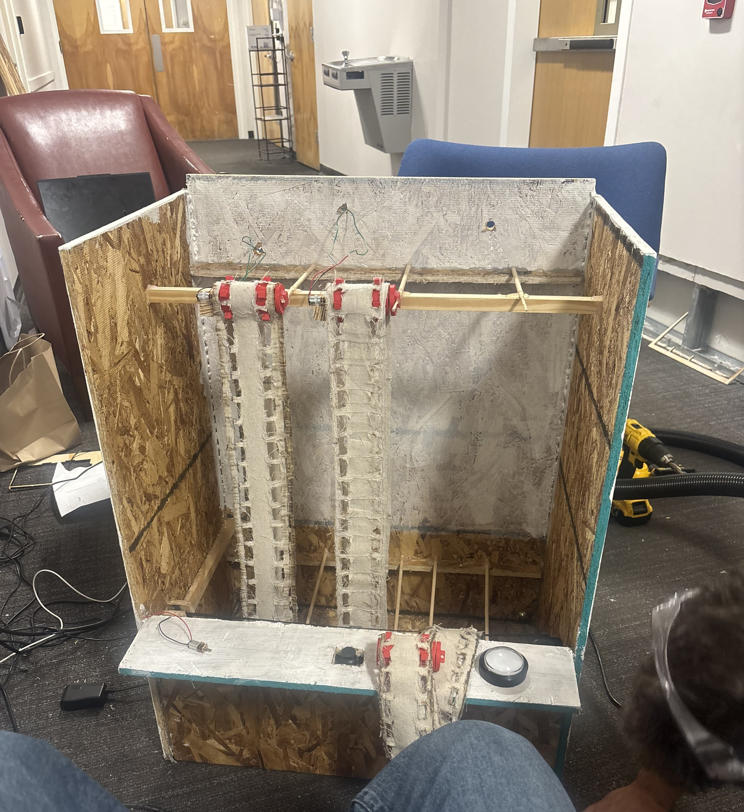
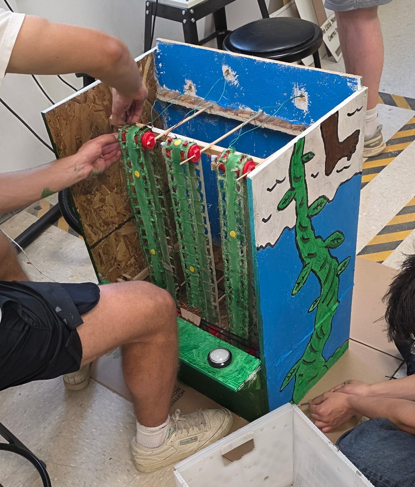

# "Catch the Falling Objects" - Arcade Game Build

## Game Concept

The arcade game, based on Jack and the Beanstalk, was designed to be a classic “catch the falling objects” concept. Golden eggs fall from the clouds down the beanstalks and the user has to control a basket to catch the eggs as they fall. Every egg that passes through the basket adds a point to the player’s tally, and the goal is to catch as many eggs as possible within the 30 second time constraint. We have three manufactured vertical timing belts that rotate throughout the 30 seconds; they have eggs attached to them with magnets on the front. The basket is on a horizontal belt at the bottom of the game, with a hall effect sensor on the side that faces the vertical belts. The basket can move to three set positions in front of each of the bands, sensing the magnet when an egg passes by. At the end of the 30 seconds the basket returns to the middle position and everything stops spinning until the start button is pressed again.

---

## Demo Video
https://github.com/user-attachments/assets/57ea5e9a-5529-44c0-9c8f-fc6eea5776d1

## CAD Drawings - Vertical Band

The CAD drawings below show the mechanical design and custom manufactured components used in the arcade game build.

  
   
  <a href="cad/Game_Belt_Orthographic.pdf">PDF Link</a>

  
  
   
  <a href="cad/Game_Belt_Exploded.pdf">PDF Link</a>
  &nbsp;&nbsp;&nbsp;&nbsp;&nbsp;&nbsp;&nbsp;&nbsp;&nbsp;&nbsp;&nbsp;&nbsp;&nbsp;&nbsp;&nbsp;&nbsp;
  <a href="cad/Slotted_Drive_Belt_Orthographic.pdf">PDF Link</a>

  
  
   
  <a href="cad/Idler_Roller_Orthographic.pdf">PDF Link</a>
  &nbsp;&nbsp;&nbsp;&nbsp;&nbsp;&nbsp;&nbsp;&nbsp;&nbsp;&nbsp;&nbsp;&nbsp;&nbsp;&nbsp;&nbsp;&nbsp;
  <a href="cad/Drive_Sprocket_Orthographic%20(1).pdf">PDF Link</a>

## Programming/Electronics

The game was programmed in C++.

The code controls the logic of the arcade game, including player input, movement timing, system response, and reset behavior. It is split into two different circuits to deal with varying voltage levels and interference from the motors onto the sensor.

  
  

### Arduino Code Files

- [Main Game Code](code/HorizontalBandCode.ino)
- [Sensor/Motor Circuit Code](code/VerticalBandCode.ino)

## Design Process

### Initial Concept

- The goal was to build a classic “catch the falling objects” arcade game inspired by *Jack and the Beanstalk*.
- Golden eggs would move down the vertical bands, while the player controlled a basket that moved horizontally across the bottom of the game.
- The basket had to stop at three fixed positions and use a hall effect sensor to detect the magnets attached to the eggs.
- From the beginning, the game required mechanical movement, electronics, sensor logic, timing systems, and C++ code to work together.

---

### Mechanical Design

- The mechanical design centered around four belt-driven systems: three vertical belts for the eggs and one horizontal belt for the basket.
- We designed and manufactured several of the main parts ourselves, including the vertical bands, sprockets, and support structures.
- CAD modeling helped us plan the spacing, alignment, and movement paths before building the physical system.
- One helpful design decision was leaving the top of the game unattached, which made it much easier to access the inside of the game during testing.
- The hall effect sensor wiring also needed to move with the basket, so we added extra slack and routed the wires around the moving parts to reduce interference.

https://github.com/user-attachments/assets/63af64f7-019d-4e8d-bfbd-29849f61da64

---

### Prototyping and Testing

- A lot of the project changed once we moved from the idea on paper to the physical build.
- The vertical bands took the most iteration because small alignment issues could affect how smoothly they rotated and how consistently the sensor detected the magnets.
- We adjusted the spacing, supports, and magnet placement several times to make the game more reliable.
- We also ran into electrical interference from the motors, which affected the LCD display and hall effect sensor when everything was connected to one circuit.
- To solve this, we separated the electronics into two circuits while keeping them connected to the same timing system.
- The final version was also simplified from the original concept. We moved from five vertical belts to three and used flatter egg and basket designs to reduce physical interference and improve consistency.

  
  

---

### Final Build

<table>
  <tr>
    <td width="38%" valign="top">
      
    </td>
    <td width="62%" valign="top">
      <ul>
        <li>The final arcade game combined mechanical motion, electronics, programming, and physical fabrication into one working system.</li>
        <li>The game runs on a 30-second cycle, during which the player moves the basket between three positions to catch magnetic eggs traveling down the vertical bands.</li>
        <li>The horizontal basket system became one of the strongest parts of the final design because it moved precisely enough for the sensor to reach each catching position.</li>
        <li>The final build brought together multiple motors, sensors, custom parts, and C++ control logic.</li>
        <li>Throughout the build, we improved the system by solving alignment, wiring, voltage, and interference problems through testing and redesign.</li>
        <li>By the end of the project, the game successfully met the original goal of creating an interactive physical arcade game from scratch.</li>
      </ul>
    </td>
  </tr>
</table>

## Bill of Materials

| Item | Source | Unit Cost | Quantity | Total Cost |
|---|---|---:|---:|---:|
| Particle wood board | Home Depot | $8.52 | Around ⅔ | $6 |
| 1x1 inch by 14ft wooden plank | Home Depot | $2 per foot | 6 ft | $12 |
| Acxico mini micro gear motor | Amazon | $3 | 3 | $10 |
| DIANN dual DC stepper motor | Amazon | $2.70 | 3 | $8 |
| 12v Power Supply | Amazon | $9 | 1 | $9 |
| 5050 RGB LED | Amazon | $6 | 1 | $6 |
| GT2 Timing Belt | Amazon | $0.61 per foot | 6 ft | $3.66 |
| MAKERELE nema stepper motor | Amazon | $10 | 1 | $10 |
| Hall effect sensor | Amazon | $0.40 | 1 | $0.40 |
| Button | Amazon | $4 | 1 | $4 |
| Canvas drop cloth | Amazon | $15 | Around ⅓ | $5 |
| Magnets | Arduino Kit | - | 20 | - |
| Arduino | Arduino Kit | - | 2 | - |
| Breadboard | Arduino Kit | - | 2 | - |
| LCD Display | Arduino Kit | - | 1 | - |
| Basic speaker | Arduino Kit | - | 1 | - |
| Joystick | Arduino Kit | - | 1 | - |
| Paper (Golden Eggs) | Lab | - | - | - |
| Sprocket axles | 3D print (lab) | - | 6 | - |
| Sprocket Pegs | 3D Print (lab) | - | 9 | - |
| ¼ inch dowels | Lab | - | 7 | - |
| 9V power adapter | Lab | - | 3 | - |
| Paint | Lab | - | - | - |
| Hot glue | Lab | - | - | - |
| Wire | Lab | - | - | - |
| 1.5” nails | Lab | - | - | - |

### Total Cost: $74.06
